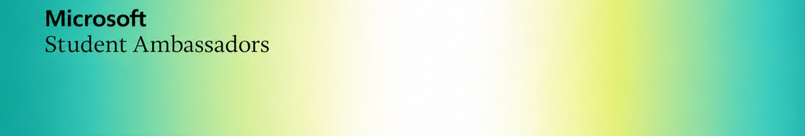

  

### KOREA COMMUNITY

# Learn. Share. Build. Together.

**Microsoft Student Ambassadors in Korea, connected in one place.**

배우고, 나누고, 함께 만들며  
한국의 Microsoft Student Ambassadors가 함께 성장하는 공간입니다.

 

---

## 👋 Welcome to MSA Korea

**Microsoft Student Ambassadors Korea**는  
한국에서 활동하는 Microsoft Student Ambassadors가 서로 연결되고  
각자의 경험과 지식을 나누며 새로운 활동을 함께 만들어가는 커뮤니티입니다.

학교도, 지역도, 관심 분야도 서로 다르지만  
**Microsoft Student Ambassador라는 공통의 연결점**을 중심으로 함께합니다.

누구나 자신의 아이디어를 제안하고  
배운 것을 공유하고  
새로운 프로젝트와 활동을 시작할 수 있습니다.

> **Built by Ambassadors, for Ambassadors.**

---

## ✨ What We Do

<table>
<tr>
<td width="50%" valign="top">

### 📚 Learn

AI, Cloud, GitHub, Developer Tools 등  
다양한 기술과 주제를 함께 공부합니다.

혼자 배운 내용을 기록하고 공유하며  
커뮤니티의 지식으로 만들어갑니다.

</td>
<td width="50%" valign="top">

### 🎤 Share

배운 기술과 경험을  
서로 나누고 공유합니다.

작은 경험 하나도  
누군가에게는 새로운 시작이 될 수 있습니다.

</td>
</tr>

<tr>
<td width="50%" valign="top">

### 💻 Build

아이디어를 실제 프로젝트로 만들고  
다른 Ambassador들과 함께 협업합니다.

작은 실험부터 새로운 서비스까지  
함께 만들며 성장합니다.

</td>
<td width="50%" valign="top">

### 🤝 Connect

학교와 지역을 넘어  
한국의 Student Ambassadors가 서로 연결됩니다.

새로운 사람을 만나고  
새로운 협업과 기회를 만들어갑니다.

</td>
</tr>
</table>

---

## 🌱 One Community, Every Ambassador

이곳에서는 정해진 활동만 기다리지 않습니다.

### **Every Ambassador can start something.**

누구나 자유롭게

💡 새로운 아이디어를 제안하고  
🎤 세션이나 워크숍을 열고  
📚 유용한 자료를 기록하고  
💻 프로젝트를 시작하고  
🤝 다른 Ambassador와 함께할 수 있습니다.

각자가 가진 서로 다른 경험과 관심이 모여  
**MSA Korea라는 하나의 커뮤니티를 만들어갑니다.**

---

## 🚀 Start Something

거창한 시작이 아니어도 좋습니다.

`Learn` · `Share` · `Build` · `Connect` · `Collaborate`

하나의 작은 아이디어가  
새로운 만남이 되고  
새로운 활동이 되고  
새로운 협업으로 이어질 수 있습니다.

---

## 🌏 We are Microsoft Student Ambassadors.

**Different schools.**  
**Different cities.**  
**Different interests.**

### One Community

 

### Learn together · Share together · Build together

 

**Microsoft Student Ambassadors Korea**

 

---

This is a community-run GitHub organization created by Microsoft Student Ambassadors in Korea and is not an official Microsoft corporate GitHub organization.

